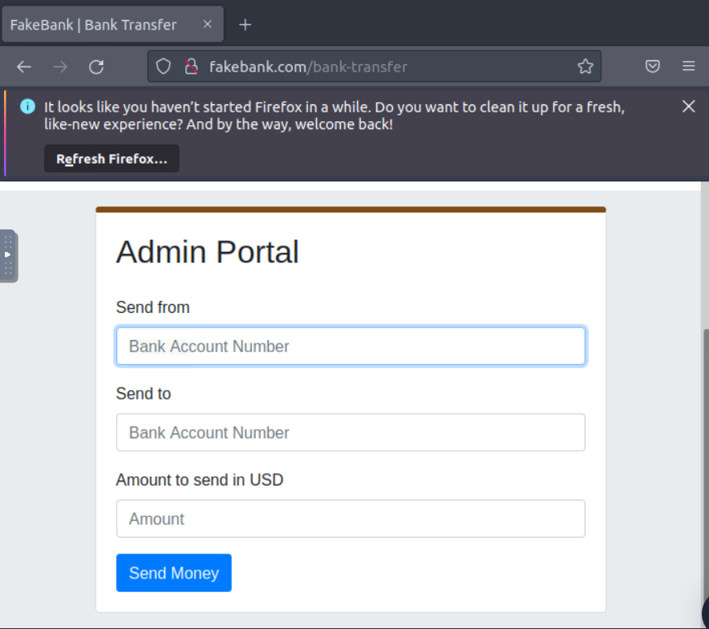
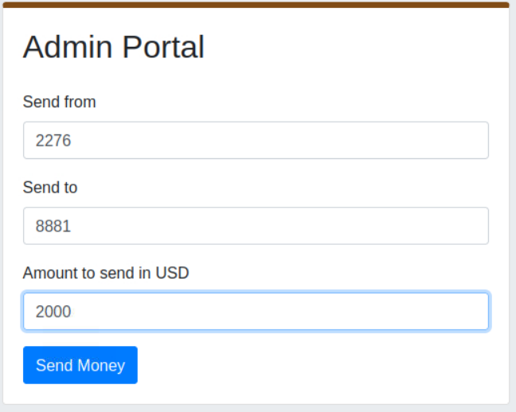

# Module: Introduction to Cyber Security

4/10/23 - In Progress 

This will teach:
- Offensive security - hacking my first app
- Defensive security - defending against a live cyber attack
- Exploring topics in the industry

# Introduction to Cyber Security
Understand what is offensive and defensive security, and learn about careers available in cyber.

## Intro to Offensive Security 
### Task 1
- Offensive security: process of breaking into computer systems, exploiting s/w bugs, and finding loophools in apps to get unauthorized access to it
- Defensive security: process of protecting an organization's network and computer sys by analyzing and securing potential digital threats
  - Investigate computers/devices to understand how it's hacked, track down criminals, or monitor malicous activity

**Quiz Questions:**

Q: Which of the following options better represents the process where you simulate a hacker's actions to find vulnerabilities in a system?

A: Offensive Security

### Task 2
**Hacking Exercise:**
- Hack a fake bank app: FakeBank
- Use command-line "GoBuster" to brute-foroce FakeBank's website to find hidden directories and pages
- GoBuster will take a list of potential page/directory names and tries accessinf a wesbite with each of them and will let me know if the page exists

**My steps/notes:**
- Open a terminal
- Type the command `gobuster -u http://fakebank.com -w wordlist.txt dir`
  - `-u` states the website that I will scan
  - `-w` takes a list of words to iteratory through to find hidden pages
  - GoBuster will scan each word in the list, finding pages that exist on the site 
  - GoBuster will tell you the pages found in the list of the page/directory names (shown by `Status: 200`)

- Type "/bank-transfer" into the FakeBank website to see the hidden page
  - This page allows hackers to steal money from any account

- I will transfer $2000 from the bank account 2276 to my account 8881

**Lesson:**
I would perform this for companies to test for vulnerabilites in hidden pages.

### Task 3
Some security roles:
- Penetration Tester: tests tech products to find exploitable security vulnerabilities
- Red Teamer: Plays adversary, attacks org and gives feedback from enemy's POV 
- Security Engineer: design, monitor, and maintain security controls, networks, and systems to prevent attacks

## Intro to Defensive Security

### Task 1
- Offensive security: break into systems
  - Exploit bugs, abuse insecure setups, take advantage of unenforced control policies, etc.
  - Red teams and pentesters
- Defensive security: prevents intrusions from occurring and detecting intrusions when they occur and responding properly 
  - Blue teams 
  - Tasks:
    - User cyber security awareness training
    - Documenting and managing assests 
    - Updating and patching systemzs 
    - Setting up preventative security devices 
    - Setting up logging and monitoring devices
  - SOC, threat intelligence, digital forensics and incident response (DFIR), malware analysis
    
**Quiz Questions:**

Q: Which team focuses on defensive security?

A: Blue team

## Careers in Cyber

- Security Operations Center (SOC): team of cyber secruity professionals that monitor networks and its sytems to detect cyber events
  - Vulnerabilities - (aka weakness) when discovered, it should be fixed
  - Policy violations - ensures protection of networks and systems 
  - Unauthorized activity - should be detected and blocked
  - Network intrusions - detect asap to minimize damage 
- SOC ensure proection via threat intelligence
  - Intelligence - info gathered about enemies 
  - Threat - action distrupting or adversely affecting system 
  - Helps acheive threat-informed defense 
  - Needs data
    - Collected from local and public sources
    - Processed to an arranged format for analysis
    - Analysis finds more info aabout attacker and creates list of recommendations and steps 
  - Allows to know tactics, techniques, and procedure (TTPs)
-Digital Forensices and Incident Response (DFIR)
  - Digital Forensics - forensics with digital systems 
    - Forensics - application of science to investigate crime and establish facts 
    - In defensive security - analyze evidence of attack, its perpetrators, and aread of intellectual property
    - Focuses on:
      - File system - analyze digital forensics image (low-level copy) of system's storage reveals info like installed programs, created/partially overwritten/deleted files 
      - System memory - analyze forensic image of system memory to learn about attacker and its program
      - System logs - client and server computer log files reveal lots of info 
      - Network logs - shows which network packets have traversed a network gives details about attack 

# Introduction to Offensive Security 
## Web Application Security

## Operating System Security

## Network Security

# Introduction to Defensive Security 
## Intro to Digital Forensics 

## Security Operations
