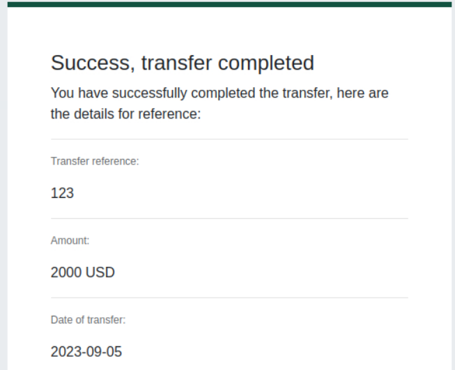

# Introduction to Cyber Security
Understand what is offensive and defensive security, and learn about careers available in cyber.

## Intro to Offensive Security 
**Quiz Questions:**

Q: Which of the following options better represents the process where you simulate a hacker's actions to find vulnerabilities in a system?

A: Offensive Security

**Hacking Exercise:**
- Hack a fake bank app: FakeBank
- Use command-line "GoBuster" to brute-foroce FakeBank's website to find hidden directories and pages
- GoBuster will take a list of potential page/directory names and tries accessinf a wesbite with each of them and will let me know if the page exists

*My steps/notes:*
- Open a terminal
- Type the command `gobuster -u http://fakebank.com -w wordlist.txt dir`
  - `-u` states the website that I will scan
  - `-w` takes a list of words to iteratory through to find hidden pages
  - GoBuster will scan each word in the list, finding pages that exist on the site 
  - GoBuster will tell you the pages found in the list of the page/directory names (shown by `Status: 200`)

- Type "/bank-transfer" into the FakeBank website to see the hidden page
  - This page allows hackers to steal money from any account

- I will transfer $2000 from the bank account 2276 to my account 8881

**Lesson:**
I would perform this for companies to test for vulnerabilites in hidden pages.

## Intro to Defensive Security
    
**Quiz Questions:**

Q: Which team focuses on defensive security?

A: Blue team

Q: What would you call a team of cyber security professionals that monitors a network and its systems for malicious events?

A: Security Operations Center

Q: What does DFIR stand for?

A: Digital Forensics and Incident Response

Q: Which kind of malware requires the user to pay money to regain access to their files?

A: Ransomware

**Practice**
- Inspect the alerts in the SIEM dashboard. Find the malicious IP address from the alerts, make not of it, then click no the alert to proceed.

- The second option is the bad alert

Q: What was the flag that you obtained by following along?

A: THM{THREAT-BLOCKED}

## Careers in Cyber

