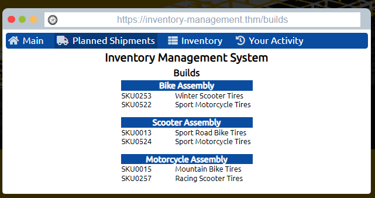
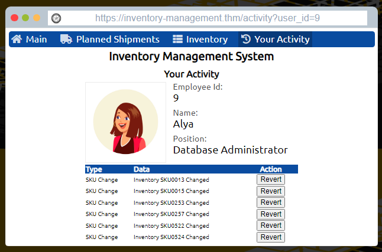

# Introduction to Offensive Security 
Understand what Offensive Security entails, and practice breaking into computer systems by exploiting applications and networks.

## Web Application Security

**Quiz**

Q: What do you need to access a web browser application?

A: Browser

Q: You discovered that the login page allows an unlimited number of login attempts without trying to slow down the user or lock the account. What is the category of this security risk?

A: Identification and authentication failure

Q: You noticed that the username and password are sent in cleartext without encyrption. What is the category of this security risk?

A: Cryptographic failure

**Hacking Exercise:**
- Investigate a vulnerable website that uses Insecure Direct Object References (IDOR)
- IDOR falls under broken access control - attacker can access info perform actions not intended for them
- IDOR vulnerability can occur if too much trust has been placed on that input data  
-Just providing the correct URL for a user or a product does not necessarily mean the user should be able to access that URL. For instance, consider the product page https://store.tryhackme.thm/products/product?id=52. We can expect this URL to provide details about product number 52. In the database, items would be assigned numbers sequentially. The attacker would try other numbers such as 51 or 53 instead of 52; this might reveal other retired or unreleased products if the web application is vulnerable 

*My steps/notes:*

- I changed the user_id in the url to different numbers to find which account was used to make the changes.

**Quiz**
Q; Check the other users to discover which user account was used to make the malicious changes and revert them. After reverting the changes, what is the flag that you recieved?

A: THM{IDOR_EXPLORED}

## Operating System Security

-
## Network Security